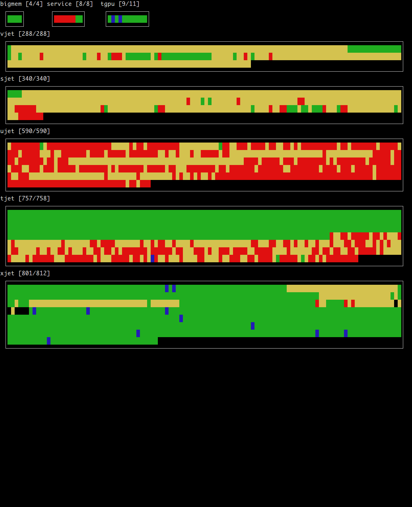

# pstat
SLURM Partition Status

## Requirements
1. Curses
2. Python

## Running
The SLURM node and partition status (sinfo) program can be run for all partitions
or for a subset. It will create a curses display of the partitions nodes
status.

The colours/states are
1. Green - Idle
2. Yellow - Compelting
3. Red - Running (all cores are used)
4. Blue - Draining
5. Black - Down

fe1 ~$ pstat <partition>

